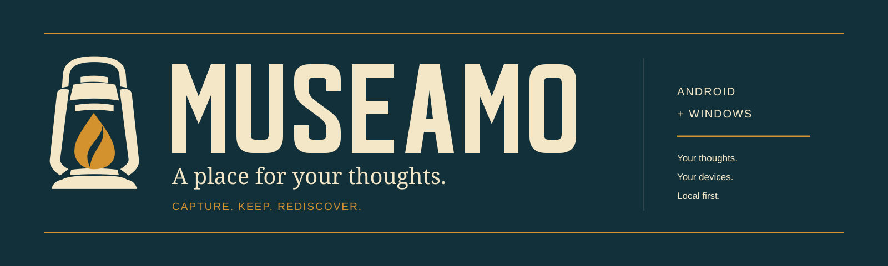
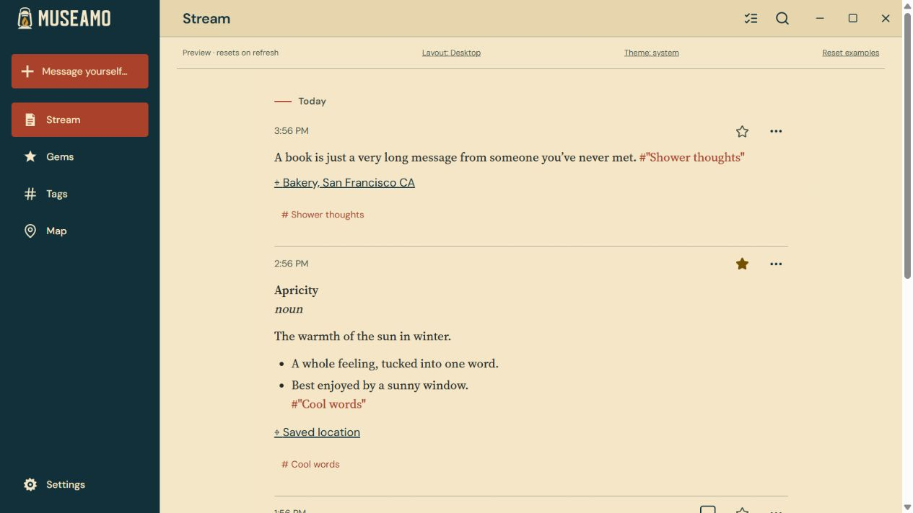
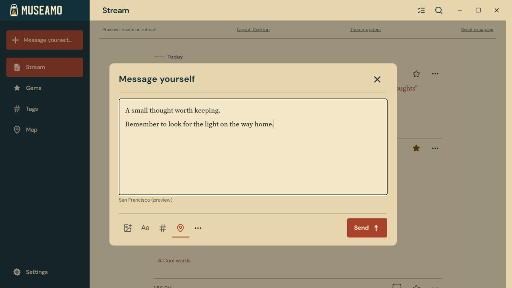
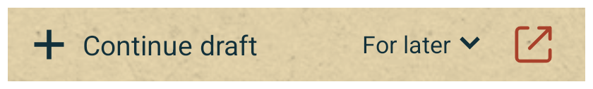
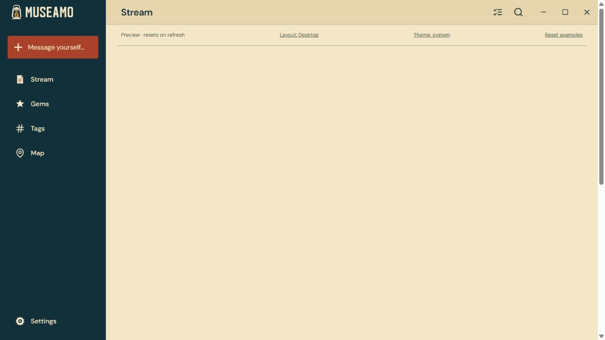
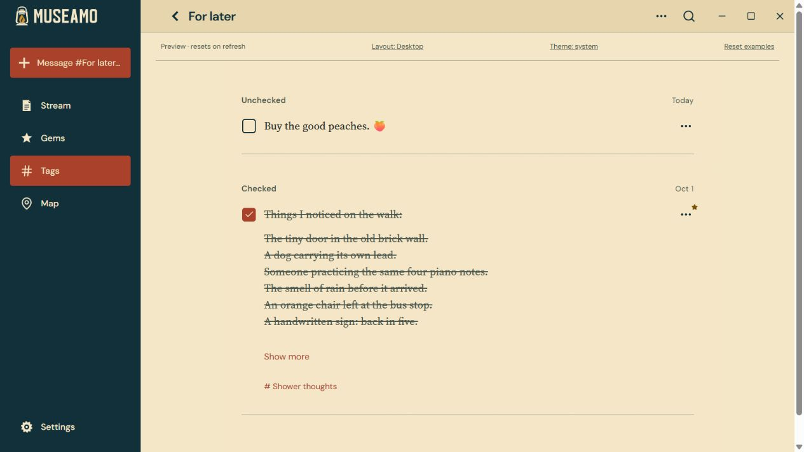
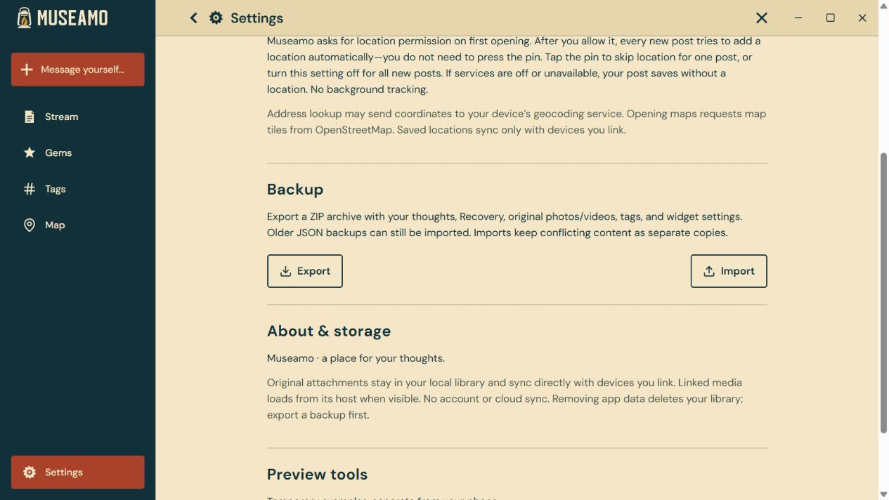
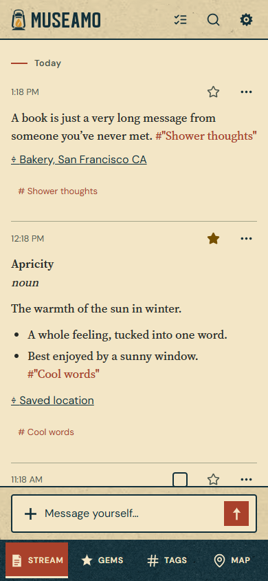
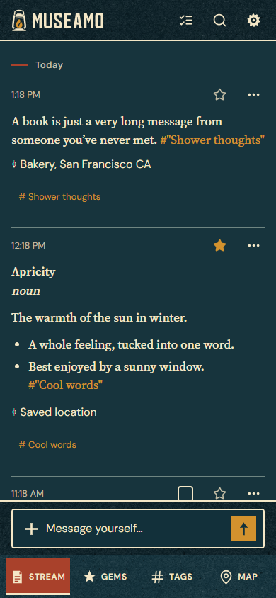

# Museamo

**A private stream of thoughts for Android, Windows, macOS, and iOS.**

Message yourself when an idea arrives. Save a word, a reminder, a photo, or something you want to remember. Come back to a searchable feed, star your favorites as **Gems**, and collect related thoughts with **hashtags**.

Your library lives on your devices. Capture works offline, and your linked Android and desktop apps sync directly over the local network. There is no account to create and no cloud service to keep running. Apple Silicon Mac builds are available from source; the early iPhone app is available through TestFlight invitations or Xcode.

[Download](https://github.com/prdoring/Museamo/releases) · [Getting started](#install) · [How to use it](#use-museamo) · [User guide](docs/user-guide.md) · [Development](#development)



*Screenshots use sample thoughts. Browser previews show simulated locations and a temporary-preview strip; native widgets are shown separately.*

## What you can do

- **Capture quickly.** Write in the app or tap a resizable Android home-screen widget. Closing capture keeps your draft.
- **Find the good bits.** Search your Stream, star thoughts as Gems, or browse by hashtag.
- **Make a checklist.** Turn a tag into a Checklist and check off its thoughts.
- **Keep more than text.** Add formatting, original photos and videos, clickable links, and optional locations.
- **Use your own devices.** Link Android and desktop libraries over your local network, with a matching-code check on both screens.
- **Keep a way back.** Export portable ZIP backups and restore deleted thoughts or earlier versions from Recovery.

The early **iPhone app** supports offline text capture and editing, durable drafts, search, Gems, tags, checklists, and local Recovery. Media, locations, portable backups, linked-device sync, shared hashtags, and widgets are still planned for iOS; their controls are hidden in the current app.

## Install

For Android and Windows, open [GitHub Releases](https://github.com/prdoring/Museamo/releases) and choose a version with downloadable assets. Successful mainline checks automatically publish Windows and Android releases once signing is configured. Early test builds may be under **Pre-releases**. Mac builds currently use the source build instructions below, and iPhone builds use TestFlight or Xcode.

| Your device | Install from | Requirements |
| --- | --- | --- |
| Android | `Museamo-VERSION-android.apk` (or `-android-debug.apk` for a test build) | Android 7 or newer; Android System WebView 111 or newer |
| Windows — recommended | `Museamo-VERSION-windows-x64-setup.exe` | 64-bit Windows 10 or 11; includes WebView2 offline setup |
| Windows — standalone | `Museamo-VERSION-windows-x64.exe` | 64-bit Windows 10 or 11 with Microsoft Edge WebView2 Runtime already installed |
| macOS | [Build from source](#macos-desktop) | Apple Silicon Mac (M1 or newer); macOS 14 or newer |
| iPhone — early build | TestFlight invitation or [Xcode build](#ios-development) | iOS 16.4 or newer; TestFlight access or a Mac with Xcode |

### Android

1. Download the APK on your phone and open it.
2. If Android asks, allow that browser or file manager to **install unknown apps**, then finish installing Museamo.
3. Open Museamo and tap **Message yourself…** to save your first thought.
4. For faster capture, long-press your home screen, open **Widgets**, and add **Museamo**.

### Windows

1. Download and run the **setup.exe** installer.
2. Open Museamo from the Start menu and choose **Message yourself…**.
3. Optionally link your phone from **Settings → Linked devices**.

The standalone EXE runs without Museamo's installer, but still stores its library in your Windows user profile. Moving the EXE does not move the library. Use **Export** to transfer your data. Windows downloads are currently unsigned and may trigger a publisher warning; download them from this repository's release page.

### macOS

1. Follow the [macOS desktop build steps](#macos-desktop) on an Apple Silicon Mac.
2. Open the generated DMG, drag **Museamo.app** into **Applications**, and open it.
3. Choose **Message yourself…** to save a thought. To link an Android phone or another desktop, open **Settings → Linked devices** and allow local-network access if macOS asks.

Mac builds use the desktop library, including attachments, locations, backups, Recovery, and local-network sync. The current Mac target is Apple Silicon. Local packages are development builds; see [desktop packaging](docs/desktop-packaging.md#macos) for signing, notarization, and packaged-app verification before distributing a Mac build.

### iPhone (iOS)

1. Install Apple's **TestFlight** app, accept your Museamo testing invitation, and tap **Install**. Maintainers can follow the [TestFlight setup guide](docs/testflight-setup.md) to configure builds and invite internal testers, including when developing on Windows.
2. Alternatively, build on a Mac and install through Xcode using the [iPhone device checklist](docs/ios-device-checklist.md).
3. Open Museamo and tap **Message yourself…**. Save a text thought, then close and reopen the app to confirm it remains. Unsent drafts also survive relaunch.

The iPhone build is an early text-library app with the features listed above. Installation currently requires testing access or a development build. Keep iPhone and desktop/Android libraries separate until iOS sync is implemented.

### Updating

On Android and desktop, use **Settings → Backup → Export** first and keep the ZIP outside the app. Install the new APK over the existing app, run the new Windows installer, or replace **Museamo.app** with the newer Mac build.

Android accepts an update only when its signing key matches your installed version. Debug and release keys are different. If Android refuses an update, keep the existing installation and export your library before changing installations. Uninstalling or clearing app storage deletes Android data. Backups include saved thoughts and attachments, but exclude unfinished drafts.

Update an invited iPhone build through TestFlight. Portable backup/export is not available on iOS yet, so keep the existing installation and use sample data while testing early builds.

## Use Museamo

### 1. Capture a thought

Tap **Message yourself…**, type, and choose **Send**. Use the photo, formatting, hashtag, and pin controls when you need them. Closing capture keeps the draft for later.



On Windows, **Ctrl+N** opens capture and **Ctrl+F** opens search. On Mac, use **Command+N** and **Command+F**.

### 2. Put capture on your Android home screen

Add a Museamo widget from your launcher's widget menu. Give it a label, then choose fixed tags or a tag picker. Each widget has its own draft. Drag the resize handles to make a compact tile or a wider card; supported sizes depend on your launcher.



Tap the message area to capture, the hashtag picker to choose a tag, or the arrow-out icon to open Museamo.

### 3. Find and organize what you saved

| View | Use it for |
| --- | --- |
| **Stream** | Everything, newest first. Search to find an old thought. |
| **Gems** | Your starred thoughts. Tap a thought's star to keep it here. |
| **Tags** | Collections such as `#Ideas` or `#"Cool words"`. |
| **Map** | Thoughts with saved locations. Tap a pin or location to explore. |

Type `#` while composing to see matching tags, or use **Add tag**. A new complete hashtag is created when you send. Multiword hashtags use quotes: `#"Cool words"`.



### 4. Turn a collection into a checklist

In **Tags**, open a tag's edit menu and select **Checklist**. Thoughts in that collection gain a checkbox, and unchecked items appear first. A thought has the same checked state wherever it appears.



The checklist icon in the **Stream** header filters the feed to to-dos across all Checklist tags.

### 5. Bring your Android phone and desktop together

Open **Settings → Linked devices** on both devices while they are on the same local network. Select the nearby device, compare the complete matching code on both screens, then approve **Combine and link** on both. Your saved thoughts, tags, locations, original attachments, and Recovery can then sync both ways.

If discovery is blocked, use **Link using an address**. Guest Wi-Fi can prevent devices from reaching one another. Opening both apps and choosing **Sync now** helps Android catch up. Windows continues syncing in the tray when you close its window; choose **Quit** in the tray menu to stop it. On Mac, closing the window also keeps Museamo running; reopen it from the Dock, and use **Quit Museamo** or **Command+Q** to stop it. iPhone linking and sync are still planned.

[More about linking and sync](docs/offline-sync.md)

### 6. Keep a backup on Android and desktop

Choose **Settings → Backup → Export** and save the ZIP somewhere safe. **Import** restores a portable archive. Use **Recovery** to restore a deleted thought or an earlier version as a new thought.



Backups are unencrypted. Keep them somewhere you trust. Sync gives you copies on linked devices, but deletions also sync, so it does not replace a backup.

<details>
<summary>Phone screenshots — light and dark themes</summary>

<p>
  
  
</p>

</details>

<details>
<summary>iPhone screenshots — light and dark simulator builds</summary>

<p>
  
  
</p>

These screenshots use synthetic test data. See [iOS verification](docs/ios-verification.md) for simulator results and remaining hardware checks.

</details>

## Your data and privacy

Museamo stores your library locally and has no analytics or account system. Full-library sync is limited to devices you explicitly link. Android also supports explicitly shared hashtags; review the sharing screen before sharing their thoughts, attachments, or locations with other people.

Some optional features use the internet: linked media contacts its host, address lookup may send coordinates to your device's geocoding service, and maps request OpenStreetMap tiles. Attached original files remain in your library. Android location capture uses foreground permission and does not track you in the background.

[Detailed user guide](docs/user-guide.md) · [Sync behavior and trust](docs/offline-sync.md)

## Development

The shared interface uses React and TypeScript. Android uses Capacitor with native Kotlin/Room storage and widgets. iOS uses Capacitor with a Swift/SQLite bridge for its offline text library. Desktop uses Tauri with Rust/SQLite storage and targets Windows x64, Apple Silicon macOS, and Linux x64. Android and desktop share a Rust core for local-network sync.

For a temporary browser preview, install Node.js 22 or newer, then run:

```sh
npm ci
npm run dev
```

The preview resets on refresh and does not save a real library. Use its layout switch for the desktop view. Native builds require the tools in the [development guide](docs/development.md).

### macOS desktop

Use an Apple Silicon Mac running macOS 14 or newer. Install Node.js 22 or newer, the repository's pinned Rust 1.99.0 toolchain, and Xcode or its Command Line Tools, then run:

```sh
npm ci
rustup target add --toolchain 1.99.0 aarch64-apple-darwin
npm run desktop:doctor -- --target aarch64-apple-darwin
npm run desktop:build -- --target aarch64-apple-darwin -- --locked
```

The app and DMG are written under `target/aarch64-apple-darwin/release/bundle/`. Use `npm run desktop:dev` for development with live reload. Local compilation needs no Apple developer account or signing certificate; distributing a signed, notarized build is a separate step.

[Desktop prerequisites and packaging](docs/desktop-packaging.md) · [Mac setup for Rust and Android builds](docs/mac-setup.md)

### iOS development

Use macOS with Xcode 26 or newer, an installed iPhone simulator platform, and Node.js 22 or newer. The app targets iPhone on iOS 16.4 or newer and uses Swift Package Manager; CocoaPods is not required.

```sh
npm ci
npm run ios:run
```

`ios:run` builds, installs, and opens the app in an iPhone simulator. Use `npm run ios:open` to open Xcode, or `npm run ios:sync` to update the bundled interface after frontend edits. `npm run test:ios` checks native persistence; `npm run test:ios:ui` checks saved thoughts and drafts across simulator relaunches.

For signed phone installation, follow the [iPhone device checklist](docs/ios-device-checklist.md). For TestFlight builds, including development from Windows, follow the [TestFlight setup guide](docs/testflight-setup.md), which covers Apple enrollment, signing, GitHub-hosted Mac builds, and testing invitations.

[iOS development details](docs/ios-development.md) · [iOS verification](docs/ios-verification.md) · [iOS roadmap](docs/ios-roadmap.md)

### Checks and releases

```sh
npm run typecheck
npm test
npm run test:release
cargo test --workspace
```

**Build and publication are separate commands.** `npm run release` checks the source without publishing. Build each desktop package on its native host; Android builds also work on macOS and Linux. Verify each platform, assemble matching artifacts, then explicitly publish the reviewed assembly. Windows can save the Android signing key with `npm run release:signing`; Unix hosts use the original key's portable backup and environment variables. [Release setup, signing backup, and commands](docs/releases.md)

GitHub Actions validates changes and retains test reports and temporary desktop build artifacts. Successful checks for pushes to main automatically reserve a patch version, build and verify Windows and signed Android downloads, and publish a stable GitHub Release. The same release version is independently uploaded to internal TestFlight. Local release commands remain available; see [automatic release configuration and recovery](docs/releases.md). The iPhone workflow also retains manual validation with upload off by default.

[Contributing](CONTRIBUTING.md) · [Architecture](docs/architecture.md) · [Design system](DESIGN.md) · [Device checklist](docs/device-checklist.md) · [Verification records](docs/verification.md)

## License

Museamo is licensed under the [GNU Affero General Public License v3.0](LICENSE). Commercial use is allowed. Distributed derivatives must provide corresponding source under the AGPL; modified network services must also offer that source to their users. Preserve copyright and license notices. See [licensing and third-party assets](docs/licensing.md).
