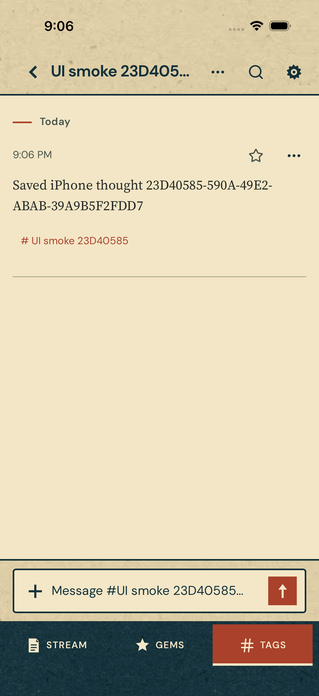
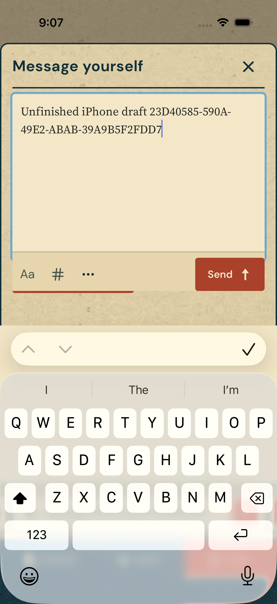
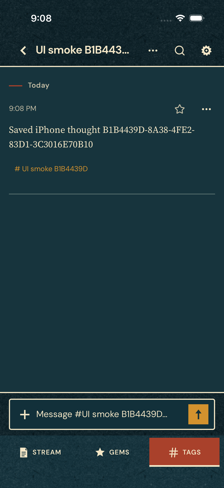
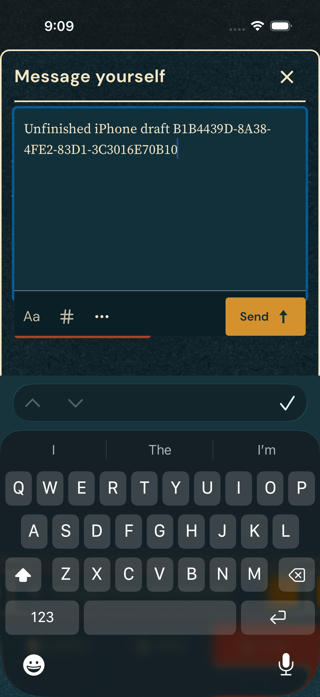

# iOS verification

## Connected iPhone candidate — October 6, 2026

Implementation is in [draft PR #13](https://github.com/prdoring/Museamo/pull/13). **All automated checks passed** on tested commit `a62a102688b1045f09307c16f444ee170a579abb` in [Checks run 37534986721](https://github.com/prdoring/Museamo/actions/runs/37534986721). Later documentation-only commits do not change the tested implementation. Required PR-head results are attached to the [PR checks](https://github.com/prdoring/Museamo/pull/13/checks).

Local checks passed: **151 frontend tests**, **51 Rust tests**, TypeScript, the production web build, 40 Apple framework-builder/change-classification tests, and 11 signing/distribution tests. Desktop passed 39 tests in the sandbox; the remaining DPAPI test passed under the normal Windows account. Existing Vite artwork/chunk warnings remain.

The [Mac validation job](https://github.com/prdoring/Museamo/actions/runs/37534986721/job/112513908047), tested October 6 on commit `a62a102688b1045f09307c16f444ee170a579abb`, passed all five Rust static-library targets, XCFramework packaging, **21 Swift tests**, the iPhone simulator build, the unsigned iPhone Release archive, compiled branding verification, and the native UI persistence test. The real Rust-listener/Swift-repository test covered invitation preview/join, private fields/history exclusion, same-name tags, original transfer/checksum, saved location, checklist changes, one-shared-tag validation, matching-code/personal-library consent, linked shared tags and private copies after leave/stop. Suspension-generation fencing, orphan-original cleanup, erasure reaching existing/fresh peers, and enrollment-response retries also passed. Android build/unit/lint, Android instrumentation, frontend checks, and Windows/macOS/Linux desktop tests and package builds all passed in this run.

The UI test ran on **iPhone 16 Pro / iOS 18.5 simulator**, with Xcode 26.3 and SDK 26.2. It saved a thought and an unfinished draft through the actual React editor and Capacitor/SQLite bridge, terminated/relaunched, verified both persisted, and checked that photo/video and manual-location controls exist. `ios-persistence-ui-results` contains the result bundle and synthetic-content screenshots in the linked run, retained for seven days. This is simulator evidence; iOS 16.4 hardware and connected-feature device acceptance remain unverified.

No connected-feature TestFlight build number or physical-device result has been recorded. The prior signed/uploaded text-only build does not validate these changes. Use the [candidate acceptance record](ios-sharing-acceptance.md) to record the exact commit/build/devices and every required scenario. Backups and automatic iPhone location capture remain deferred; see [privacy/encryption inventory](ios-privacy-inventory.md).

The PR is unmerged. The existing trusted-main release workflow also publishes Windows/Android packages when it calls TestFlight, so promoting this candidate is an owner release decision. A successful unsigned archive does not confirm signing, Apple processing, or physical acceptance.

## Historical offline foundation — October 4, 2026

Verified locally October 4, 2026 with Node 22, Xcode 26.6, iOS SDK/simulator 26.5, and Rust 1.99.0. The app targets iPhone on iOS 16.4 or newer. Signed installation, physical hardware, and the oldest supported iOS version remain unverified.

## Build and test results

| Check | Result |
| --- | --- |
| Frontend `npm test` | 148 tests across 18 files passed, including iOS routing, native errors, capability gates, and React capture. |
| `npm run ios:build` | TypeScript, production web build, Capacitor sync, and unsigned simulator build passed. Existing Vite asset/chunk warnings remain. |
| `npm run ios:launch` | Booted an available iPhone simulator, installed the built app, and launched it. |
| `npm run test:ios` | 11 Swift repository tests passed: reopen persistence, atomic/idempotent saves, rollback, cursors, Recovery, stale edits, JSON booleans, Unicode/NUL, and timestamp bounds. |
| `npm run test:release` | 11 tests passed. |
| Android builder `node --test scripts/build-sync-android.test.mjs` | 8 tests passed. This does not validate an Android native build. |
| Shared Rust core | 47 tests passed earlier in this integration; Rust code was unchanged by the rebase and handoff. |
| Generic physical-iPhone build | Unsigned Debug `iphoneos` compilation passed. No signing, provisioning, installation, or device launch was performed. |
| Local UI persistence | Passed on iPhone 17 Pro / iOS 26.5 in both light and dark appearances (one test per run). |
| CI configuration | YAML parsed; iOS job runs Swift tests and the unsigned simulator build. UI tests stay local. Hosted execution is pending. |

The physical-device compilation used current synced web assets and:

```sh
xcodebuild -project ios/App/App.xcodeproj -scheme App \
  -configuration Debug -sdk iphoneos -destination 'generic/platform=iOS' \
  -derivedDataPath ios/DerivedData-device CODE_SIGNING_ALLOWED=NO build
```

CI selects Xcode 26.3 on `macos-15`, which is listed in the [GitHub runner image inventory](https://github.com/actions/runner-images/blob/main/images/macos/macos-15-Readme.md). Local testing used Xcode 26.6; it does not substitute for the first hosted run.

## Local persistence UI test

`npm run test:ios:ui` exercises the real WKWebView, Capacitor plugin, and SQLite repository. It creates a unique tag, saves a thought, terminates/relaunches, and confirms the saved text. It then writes an unsent draft, closes/reopens capture to verify a native read after queued writes, terminates/relaunches again, and checks the draft. Unsupported media/location controls are absent. Existing simulator data is not cleared; the synthetic thought, tag, and draft remain.

Build or sync current web assets before running the UI test. The runner accepts `IOS_TEST_DEVICE_ID`; the launch helper accepts `IOS_DEVICE_ID`. Result bundles live under ignored `ios/DerivedData/Logs/Test/`.

Successful result bundles: `Test-App-2026.10.04_21-05-33--0700.xcresult` (light) and `Test-App-2026.10.04_21-07-39--0700.xcresult` (dark). The test retains named `ios-library` and `ios-draft` screenshot attachments. These captures show only the run's synthetic data in its isolated tag. They verify the pictured simulator layouts, not the complete hardware checklist.

| Saved thought | Restored draft and software keyboard |
| --- | --- |
|  |  |
|  |  |

## Existing desktop failure

The complete Rust workspace test run is **not green**: desktop tests passed 40 of 41. `integration_tests::shared_lists_use_real_sqlite_scopes_and_linked_devices_keep_private_metadata` timed out waiting for real SQLite sync. A focused retry failed, and the same test failed on an isolated unchanged PR #5 checkout at `desktop/src/integration_tests.rs:1094`. This reproduces outside the iOS changes. The offline-foundation branch does not modify the desktop Rust implementation or the shared Rust core; investigate this failure separately before describing the whole stack as passing.

## Remaining hardware and release checks

Follow the [iPhone device checklist](ios-device-checklist.md) to select a local signing team, install on a connected phone, and verify keyboard, safe areas, accessibility, lifecycle, and update persistence. Android/Windows native builds were not rerun for this handoff. Media, location, portable backup, sync, widgets, shared hashtags, and TestFlight remain future scope. The separate Rust diagnostic snapshot is not included or linked into this app.
