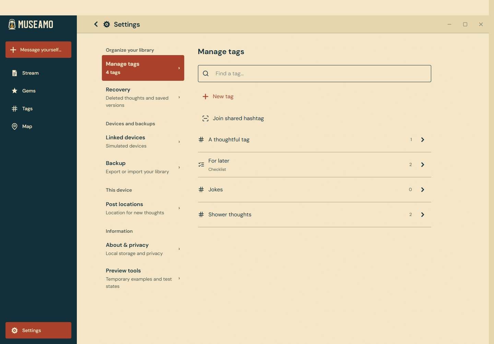
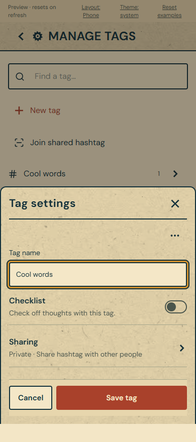
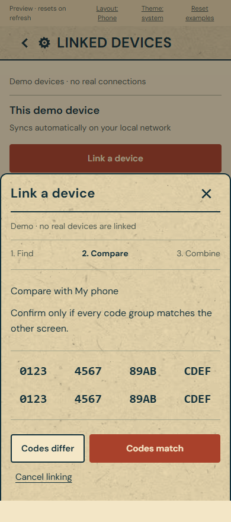

# Settings UX verification

The shared React settings, tag settings, sharing, linked-device and Recovery interfaces now use focused views. Android's native widget configuration also has shorter labels and help, retaining its persistent Cancel/Save controls. No storage schema or sync protocol changed.

## Verified locally

- TypeScript validation and production frontend build pass.
- All 164 frontend tests pass across 19 test files.
- Android `:app:compileDebugKotlin` passes with JDK 21. The unchanged Rust core task was skipped; this is a Kotlin compilation check, not an APK or installation test.
- Browser interaction checks pass at 320, 390, 640, 900, 1024, 1100 and 1440 pixels, with reduced motion and desktop light/dark themes. No horizontal overflow or browser runtime errors appeared.
- Browser platform fixtures pass for Android, iPhone, Windows, macOS and Linux. Fixtures use memory-only library data and native-response shapes; they confirm presentation and capability gating, not execution on those operating systems.
- Screenshots are saved under `artifacts/settings-ux/`. `phone-*.png` and `desktop-*.png` use the labeled browser preview. Files ending in `-fixture.png` use simulated platform capabilities.

## Review screenshots

These screenshots use the browser preview's sample data:

## Flows checked

- Manage tags opens name and Checklist immediately; sharing and deletion remain separate. Dirty dismissal protects changes. Save-and-continue retains changes after a failed save. A committed new tag is not created again if refreshing the library fails.
- Starting sharing requires explicit privacy consent. Failure to create the invitation after sharing starts retries only the invitation. Invitation cancellation failure keeps the invitation visible. Shared members get read-only fields and Done.
- Linking deduplicates nearby devices, shows the complete code in eight groups, labels the other device's library, separates both approvals, and requires actual membership for success. Pending attachments remain a separate status. Incoming pairing is visible while other settings topics are open; failed or delayed cancellation does not report success.
- Stale reads cannot overwrite a newer write, including a manual read begun during a write. Duplicate writes are blocked and recovered read errors clear. A failed refresh does not turn a committed write into a failed write.
- Recovery shows 50 compact entries initially, can show more, opens complete content on selection, and requires a separate confirmation for permanent clearing.
- Backup picker cancellation and progress are distinct; repeated export clicks do not start duplicate operations.
- Returning from settings restores the previous library search. Returning from a tag's thoughts to Manage tags preserves its tag search.
- iPhone excludes backup, Android widgets, automatic-location and desktop-startup controls. Desktop startup and close-behavior copy follows the reported operating system. Android widget rows call the existing configuration action.

## Native acceptance still required

On installed apps, verify device discovery, two-party comparison/approval, QR camera scanning, invitation expiry, real backup pickers, keyboard/inset behavior, accessibility navigation and actual background sync. Verify the native widget editor on Android. iPhone, macOS and Linux builds/device checks require their respective hosts; browser fixtures are not substitutes for those checks.

Temporary preview servers created for this verification are stopped at task completion; saved screenshots remain available without a running server.
